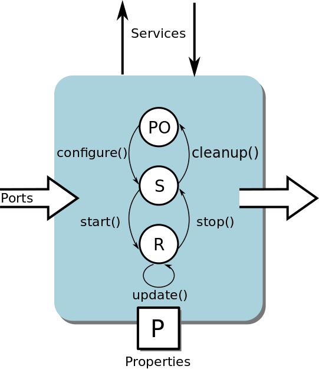
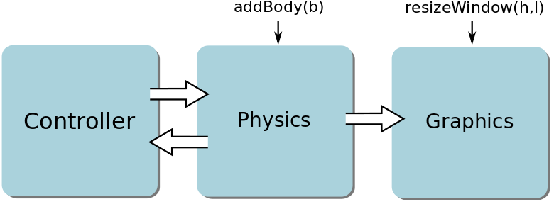

Introduction
============

In this section we will briefly describe what is the Orocos Toolchain and its relation with the XDE framework.
Indeed, XDE framework is a set of Orocos components developped by the french CEA dedicated to interactive dynamic simulation.
We will then introduce how the XDE framework is organised.

Orocos Toolchain
----------------

Orocos Toolchain is a framework to build real time applications using a components approach. The toolchain contains:
  * RTT: Real Time Toolkit, which provides a framework to write C++ Orocos components
  * OCL: Orocos Component Library, which is a set of Orocos components to manage setup and interactions between components
  * Orogen: A code generation tool to quickly generate skeleton of component including compilation scripts

Orocos Component
~~~~~~~~~~~~~~~~

Basically, an Orocos component_ is a state machine with three states:
  * Pre-Operational
  * Stopped
  * Running

The transition are triggered by hook function. The component can work in a synchronous mode, where
the ``updateHook()`` is called periodically, and in an asynchronous mode where the ``updateHook()``
is triggered by events (data on ports for example).

.. _component:

   An Orocos component.

We can interact with a component through:
  * ``Services`` or ``Operations`` which typically are functions like ``setPeriod(T)``
  * ``Data ports`` where the data are processed in the ``updateHook()``
  * ``Properties`` which are special parameters that can be set from a configuration file

OCL Deployer
~~~~~~~~~~~~

The Deployer is a special component that provides an interactive shell that enables us to manage other components. Basically, the Deployer allows us to:
  * Import a library containing a component
  * Load the component in the application environement
  * Connect ports of components
  * Start and stop components
  * Run scripts to perform those tasks

XDE and Orocos relationship
---------------------------

XDE framework is a set of Orocos components also called, in XDE applications, agents. The main ones are:
  * Physics
  * Graphics
  * Virtual human simulation
  * IO Devices

Python Interface
~~~~~~~~~~~~~~~~

XDE framework contains Python interface for RTT. As a consequence,
it is possible to write Orocos components in Python.

There is also a python interface for OCL Deployer. It allows us to import library (compiled from C++) that contains
Orocos components, to load components and to connect them in Python. Basically, in order to build a simulation,
we have to write a Python script that will be an equivalent of an OCL Deployer script, loading, configuring and connecting different components.

.. _xde_deploy:

   An example of a deployment in XDE.

XDE Simulation
--------------

Scenes
~~~~~~
XDE use the concept of Scenes:
There are two types of scene, the first one will represent what will be simulated and are used 
in the physical and graphical agents.
The second type of scene will describe the objects.

Graphical and physical agents
"""""""""""""""""""""""""""""
The physical and the graphical agents have their own scenes. The object represented in those scenes
will be considered for the dynamic simulation.
The physical agent have two scenes:

* The GVM Scene which contains the physical information of the objects.
* The XCD Scene which contains the collision description of the objects.

The graphical agent have one scene:
* The MainScene which contains the visual description of the objects.

World description
"""""""""""""""""
Generally speaking, in order to simulate an environment in XDE, the objects have to be described in three
scenes: the graphical, the physical and the collision scene. A scene is a tree where each node represent a body
with some properties. The children of the nodes will be used to define some hierarchy.
For instance kinematic hierarchy.

* The graphical scene describes the visual shape, the color, the texture... of the objects.
* The physical scene describes the physical properties of the objects such as the mass, the moments of inertia, the contact material.
* The collision scene describes the collision geometry of the objects which is used by the physic engine
  to determine if two objects have collided. Usually this geometry and the graphical geometry are the same, unless
  we want a simplified collision geometry to decrease computation time of the collision detection algorithm.

The three scenes are stored in a structure called *world* and encoded in a Protobuf message.
In order to simulate the objects described in a *world* structure, we have to inject the three scenes of the *world*
into the scenes of the graphical and physical agents. This operation is called the ``deserialization``.

